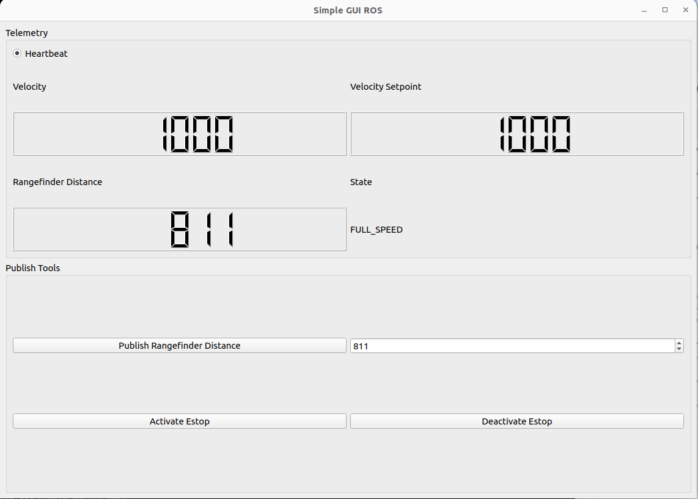
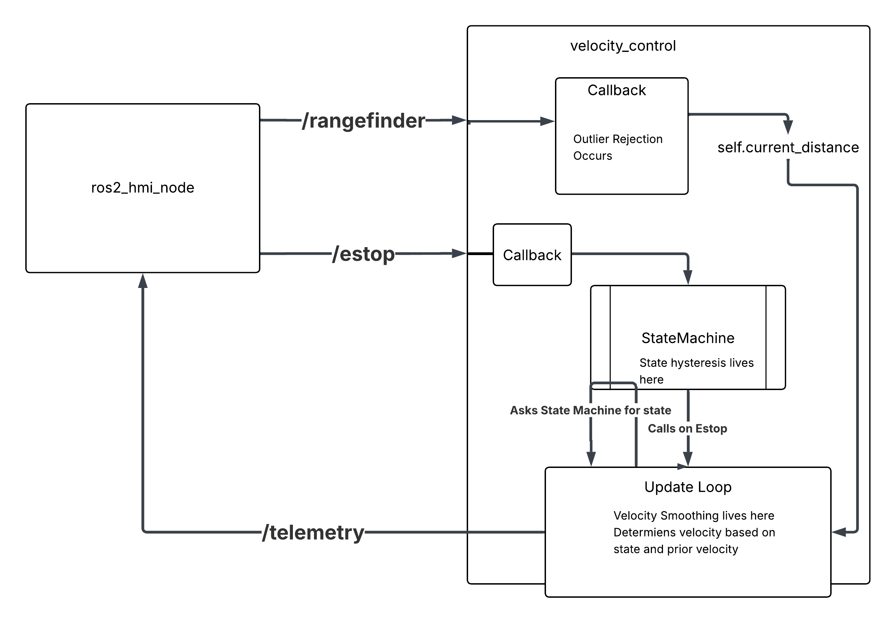

# RangeFinderBot

A simple demo of a robot leveraging a rangefinder to modulate speed.

The code has been tested to function with ROS 2 Humble Hawksbill.

---

## Usage Instruction

1. Clone this repository in the root of your ROS2 workspace: `git clone --recurse-submodules --remote-submodules https://github.com/davelkan/RangeFinderBot/`
2. Submodule won't default to correct branch, so `cd RangeFinderBot/simple_gui; git checkout rangebot_branch`
3. Install the necessary dependencies of the for the GUI: `pip3 install pyqt5`
4. Build the package at the root of your workspace: `colcon build`
5. Source the setup file from the root of your workspace: `source install/setup.bash`
6. Start the velocity_controller and gui `ros2 launch range_bot velocity_controller`
7. Try out the controls and see how the telemetry responds

Note: There may be a version issue with tests, installing the correct version of setuptools should fix this
`pip3 install setuptools==58.2.0`
Note2: To close everything smoothly you will need to manually exit the GUI

This should open up a small HMI as shown below:

    

## Features

You'll find 3 packages inside this Repo

### range_bot 
In here you'll find the core components of the challenge. By default the robot will be stopped below 400mm, slow between 400 and 800 mm, and full speed above 800 mm rangefinder distance.
velocity_controller.py implements the primarylogics. It subscribes to an external estop and rangefinder, incroporating that data to determine the output
speed and state of the bot. This data can be viewed by waching the /telemetry stream after launching the node. Some features include
- rangefinder input with outlier rejection: A rolling queue of rangefinder data is maintained allow outlier rejection outside of 3-sigma of the current
reading. This data is still tracked and will influence the stdev going forward. To prevent a possible edge case, the rolling queue is reset if too many
outliers are rejected sequentially
- Estop input - which blocks updating the velocity setpoint
- State Machine - A simple state machine is included to manage transitions from state to state, and to select the idealm state based on the current
rangefinder distance. The state machine includes a simple hysteresis to prevent rapid flipping between adjacent states. Target velocity is set based
on the state machine output.
- Velocity Smoothing - A velocity setpoint coupled with a max accel is userd to smooth velocity and mitigate rough changes in velocity. Maximum accel is
increased in case of Estop

### more_msgs
- messages leveraged by range_bot and simple_gui

### simple_gui - forked from https://github.com/sampreets3/simple_gui with minor changes to serve as a gui for range_bot
Reports telemetry and allows user to send custom range finder readings or activate/deactivate the estop to see the results
- Telemetry
Velocity Setpoint, Current Velocity, State, and Current Rangefinder distance
- Controls
Publish a new rangefinder reading, activate/deactivate Estop

## Basic Architecture Diagram

    

---
